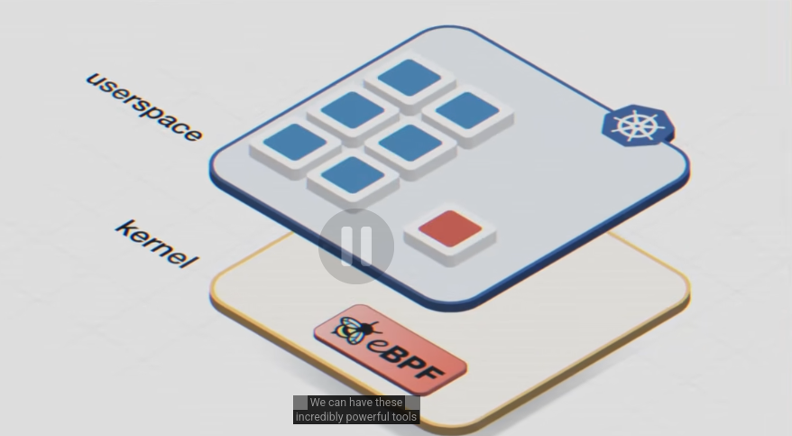
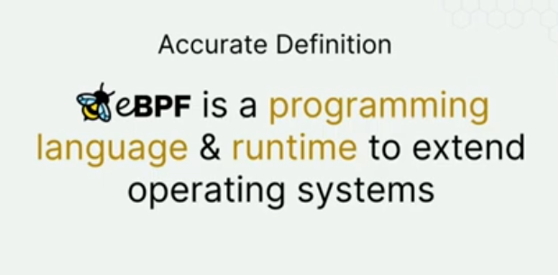
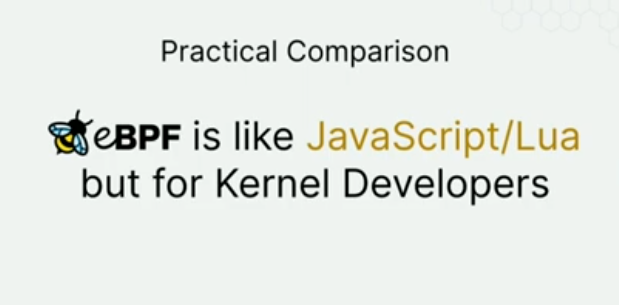

**SDN - Software Defined Networking**
SDN stands for Software-Defined Networking. It’s a way of designing computer networks where the control of the network is separated from the actual hardware that forwards data.

*Traditional Networking*: Each router/switch makes its own decisions.
*SDN Approach*: SDN moves the brain of the network into a centralized software controller.
The controller:
- decides routing
- manages policies
- configures switches
- monitors traffic
Switches:
- just forward packets based on instructions

So:
**Control Plane** → centralized software
**Data Plane** → simple forwarding devices

&nbsp;

- For safety of loaded programs ino the kernel by language and compiler. realised that the compiler cannot be trusted, so kernel must not trust what is being loaded from user space. So it must be able to verify security by itself.
- so, come up with new insruction set spcifically for this. 
- How could yo insert directly into the kernel, a probe point that would capture a packet give it to a small program to look at the contents of the packet and decide what to do with it.
- so decided to extend the Berkley Packet Filter

BPF was basically a way to make packet-sniffing tools efficient.
For example, suppose tcpdump wants to monitor only HTTP traffic (port 80).

Without BPF:

```
Network card → Kernel → send EVERY packet to tcpdump
tcpdump → manually check each packet
```
This wastes time because most packets are irrelevant.
With BPF:

```
Network card → Kernel BPF filter checks packets
Only packets matching "port 80" → sent to tcpdump
```

So BPF’s role was:
> run tiny filtering rules inside the kernel so networking tools only receive the packets they actually asked for.

&nbsp;

-eBPF then pivoted to kernel-tracing
**kernel-tracing**: observing what the linux kernel is doing while the system is running. (what sycalls are made, how long disk reads take, when packets arrive, etc)
- Application → syscall → Kernel does work → tracing observes this
Similar to logs, but much more low-level and real-time. Tracing is closer to attaching sensors inside the operating system.



&nbsp;

**XDP** stands for eXpress Data Path.
- It is a super-fast packet processing layer in Linux built using eBPF.
- The key idea: XDP lets eBPF programs process packets extremely early — before the normal networking stack handles them.

usually: 
- Network Card → Kernel Network Stack → Application
with XDP:
- Network Card → XDP program → maybe drop/modify/forward packet → only then normal stack

- eBPF intially only adopted by hyperscalers, later Cilium built for end users
  
*on-premsie*: software or infra running on a company's own datacenter instead of someone else's cloud

&nbsp;




eBPF allows you to run a sandbox technology within the kernel. like a VM inside the kernel. Allows to extend the kernel without having to compile or load th whole thing again. 

&nbsp;

eBPF has an event-based architecture. An event can be a syscall, a network packet arrival, or a kernel functionality that we implemented. We write a sanboxed eBPF program, hook it onto the required event, and when that event occurs, the kernel runs our program.
eBPF architecture has a crucial component - verifier (performs analysis to see if it crashes, has infinite loops, has the privelege level required, etc.)

bcc library is a pyhton lybrary to help write ebpf 

eBPD Maps: highly efficient data structure that lives in kernel acts as a bridge between User Space adn kernel Space

K-probe: A linux kernel mechanism that helps us dynamically attach to any kernel event to help tracing


