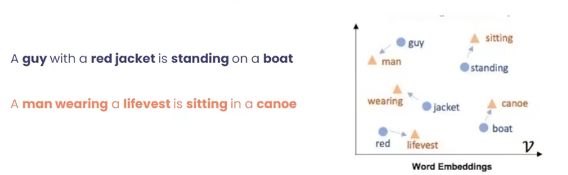
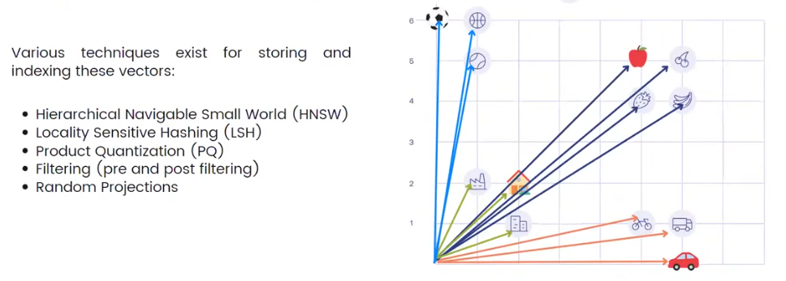
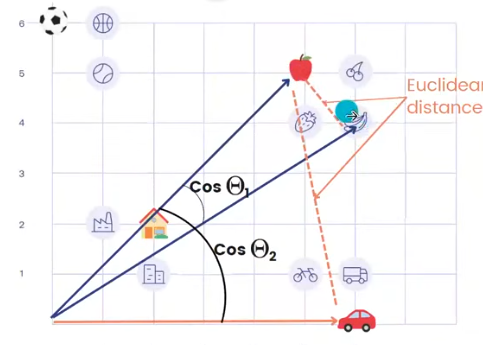
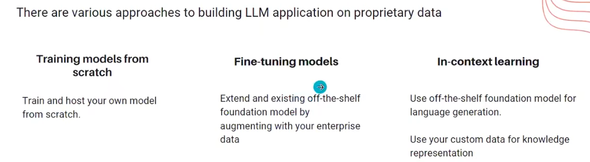
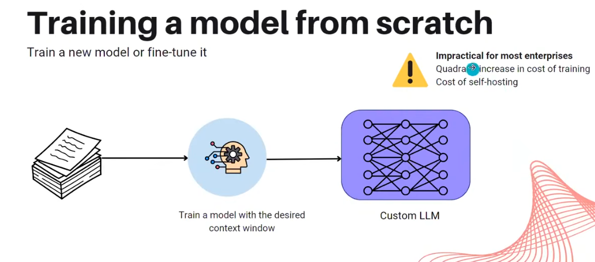
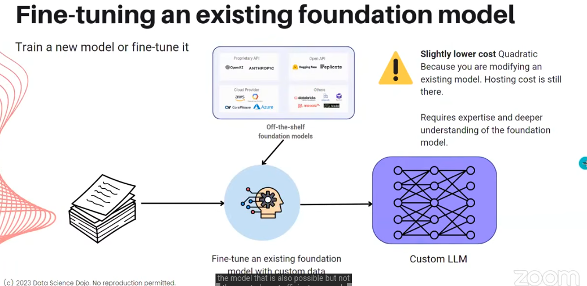
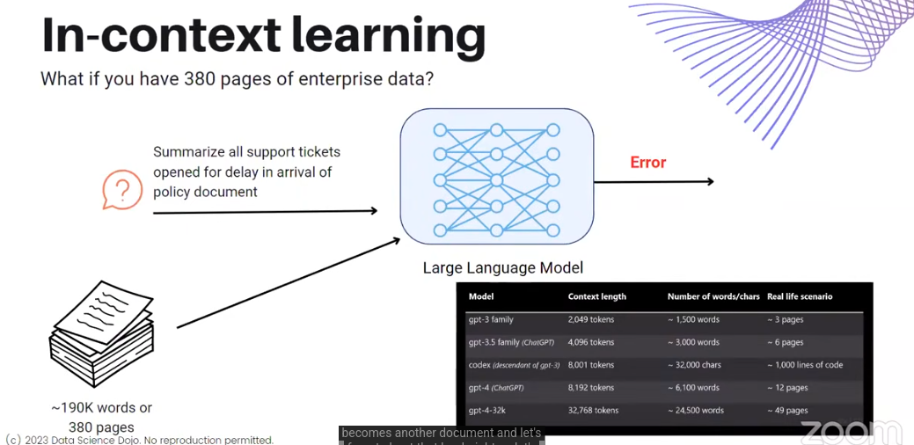
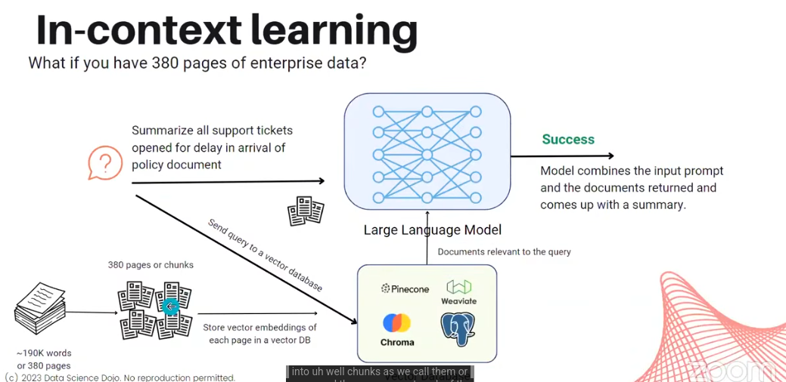
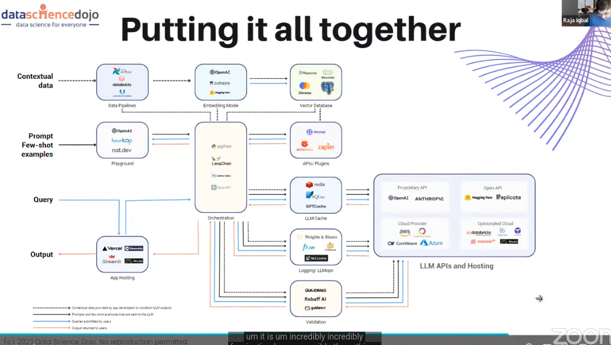

# FUNDAMENTALS

## EMBEDDINGS
- turning text into vdectors while considering semnatic relationships
- 

### VECTOR DATABASE
- Audio -> audio model -> audio vector embeddings -> eg.RedisSearch Vector Similarity Search
- Text -> text vector embeddings, etc.
- Vector databases are optimised storing, indexing and retrieving unstructured data
- When a new object (say, word) is inserted, the semantically similar set of objets is found using various indeixing techniques
- 

Vector Similarity: (common measures) 1. Cosine Similarity 2. Euclidian Distance

- FOUNDATIONAL MODEL: llms trained on massive amounts of public data eg: ChatGPT

### CONTEXT WINDOW AND TOKEN LIMITS
- token = unit of text read by model
- context window ~ RAM for LLM
- when context window exceeded it cannot work on previously mentioned content
- Input tokens->Predict next token->Add it to context->Predict another

## CUSTOMIZING LLMs

- 
- 
- llms have cache to answer re-questions
### INTEGRATION
- 