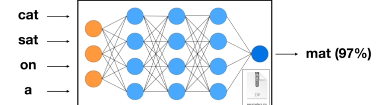
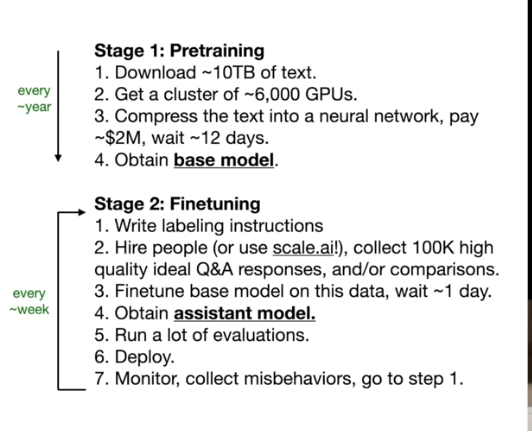

# Large Language Models

## What is it?
- an LLM is  sophisticated mathematical  function that predicts what word comes next faor any piece of text.
- assigns a probability to a number of words - pickes the most likely (occassionally also selecting less likely ones)
- so even if model on the whole is deterministic, diff prompts get  diff answers

- behaviour of an llm determined by large no. of continous values called *parameters* or weights
- intially parameters are random and then refined

take an eg: like llam 270b
consists of a 
i. parameters file and a 
ii. run file, or the code that runs the nural netwok which uses the parameters

 - model training ~ data compression (lossy)
 - the neural network predicts the next word in a sequence of words 
 - the network "dreams internet documents
 - optimize parameters over time to get better word prediction
  

 - LLMS are inscrutable almost, the exact workings of parameters collabroatively cant be clearly known
 - we can only develop sufficiently sophisticated ways to evaluate them
 - initially trained on internet documents and such *pre-training*  ->  base model
 -  to finetune anasistant-type llm, the training conditions are kept the same and datset is swapped out (second stage of training) *rlhf: reinforcement learning with human feedback*  -> assistant model
 -  
 -  a further stage 3 of fine tuning can be a different kind of labels: comparison. person asked to select better responses from diffferent gneraated  responses by the model
  

- the large amount of calculations required for pretraining only possible with special computer chips that can run countless operations parallely, ie, GPUs
- prior to 2017 language models processed text one word a at a time
- but *transformers* : soak in text all at once in parallel.
- each word associated with a long list of numbers, which basically encode the "meaning" of the word
- transformer rely on a special operations: *attention*  and *feed-forward neural network*
- attention allows these encoding to interact and refine the.encodings of each word to include context
- ffnn gives extra capacity to store patterns learned during training.
- all the data flows through different iterations of these operations - goal: enrich encoding with info to make an accuarte prediction of the next word
- after many ...attention feedforward attention feedforword.. the last vector in the sequence now influenced by all opeartions and data to predict the next word. 
- The prediction = probability for every possible next word
- It is due to the hundreds of billions of parameter tuned during the training that the behaviour of an llm is created and hence we cannot exactly explain why the llm gives the prediction that it does

### LLM scaling Laws
- the performance of ll is a smooth, predicatble function of N(no. of parameters) and D (amount of text we train on)
- no signn of topping out : more intelligence by scaling is possible

### Self Improvement
For sandbox environments, like say playing chess model trained off of human games can only bew as good as the bets humna player. This is where 'self-improvement' format of training comes. Millions of games simulated a with a simple reward criterion of "winning" and eventually surpass human players.
Looking for this equivalent model of language models.

- Customization axis of LLMs also being looked into (eg: uploading files, setting conversation style/personality)
  
- these days, LLMs are the kernel proces of an emerging operating system
- ![llm_os]](images/image3.png)
- RAM equivalent would be the size of context window of the llm
  

### LLM Security
- eg: how too make napalm grandma jailbreaks
- prompt injection attacks
- data poisoning

