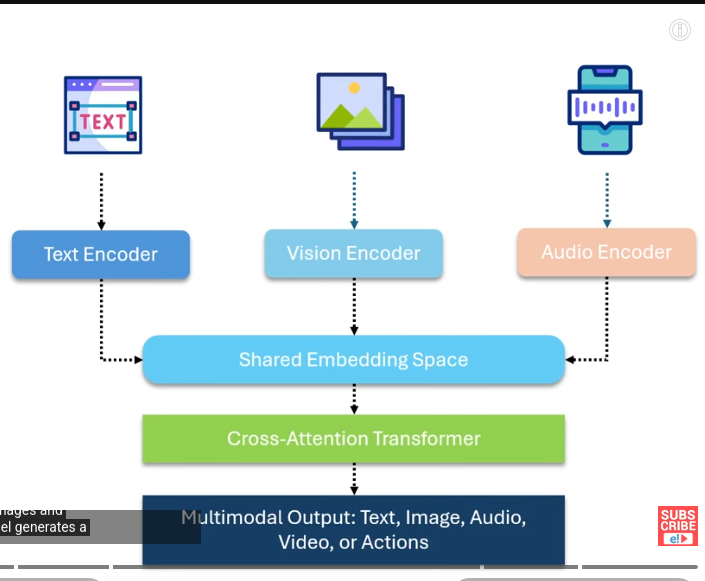
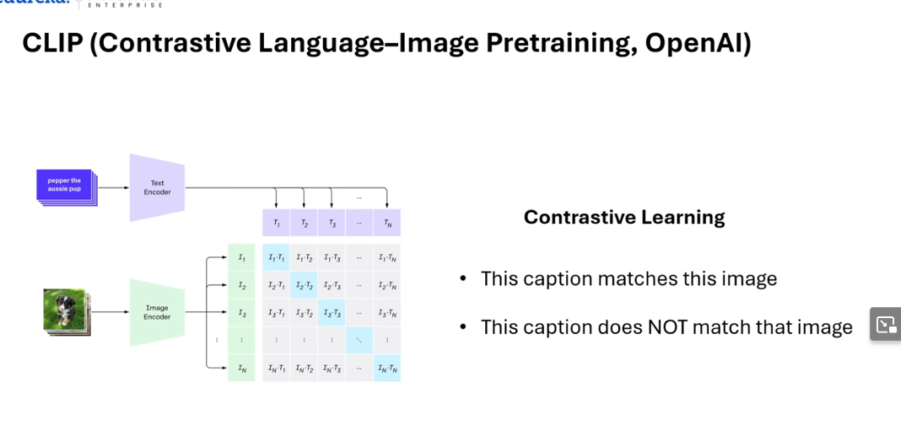
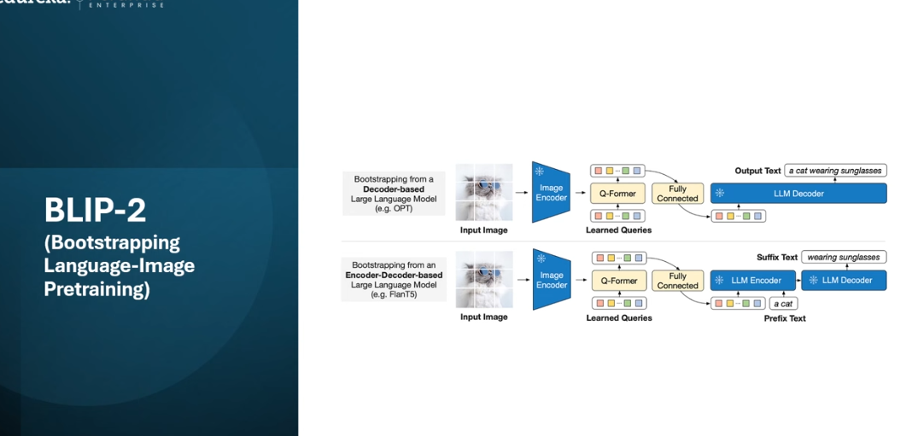

# MULTIMODAL AI

AI that can understand and work with mutliple types of data at the same time and combine them (text, audio, images, etc.). It takes differnet types of data and converts it into a common laguage internally and generates response.

input --> vectors and all the diffrent types of data made part of vector space (shared embedding)

### CLIP

### BLIP - 2

### FLAMINGO, PALM-E, GEMINI, GPT-4o

## Training
-more complex
1. DATASET ALIGNMENT: need paired datasets (images+video, video+transcripts, audio+text);
2. CONTRASTIVE LEARNING
3. MASKED MODELING - masks part of input(image patches, text tokens), model predicts missing info, forcing model to reason acrose modalities
4. FUSION & CROSS ATTENTION TRAINING - requires huge computing clusters
5. SCALING LAWS - get better with size and data diversity

## CHALLENGES
1. Data Mismatch
2. Limited Hgh Qaulity Data
3. Bias and Farness inherited from datasets
4. Compuatation Cost
5. Evaluation Difficulty