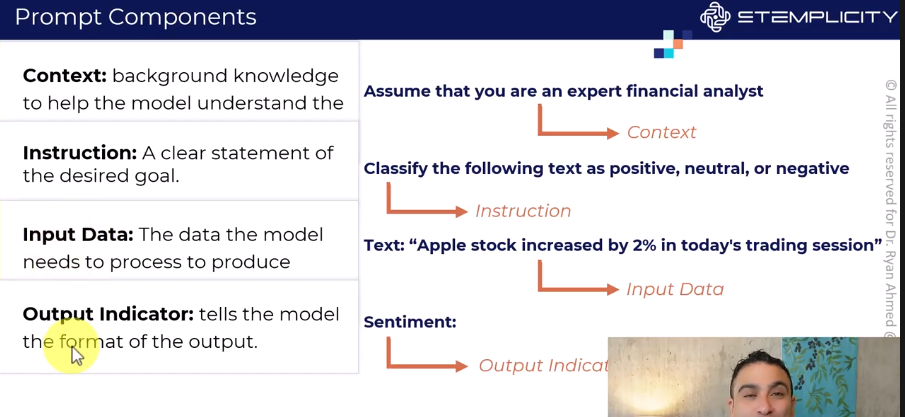

# PROMPT ENGINEERING
- practice of designing and optimizing text input to genrative AI models to obtain desired responses

# ZERO-SHOT PROMPTING
- ai model can genrate responses wo bein provided with any prior examples
- model relies on broad knowledge from training data

# FEW_SHOT PROMPTING
- provide a fe w input/output pairs of examples to Guide the models repsonses

# CHAIN OF THUGHT PROMPTING
- break problems into small chunks so that wach prompt is one chunk and its reasoning ability is improved

for reference: https://cloud.google.com/discover/what-is-prompt-engineering